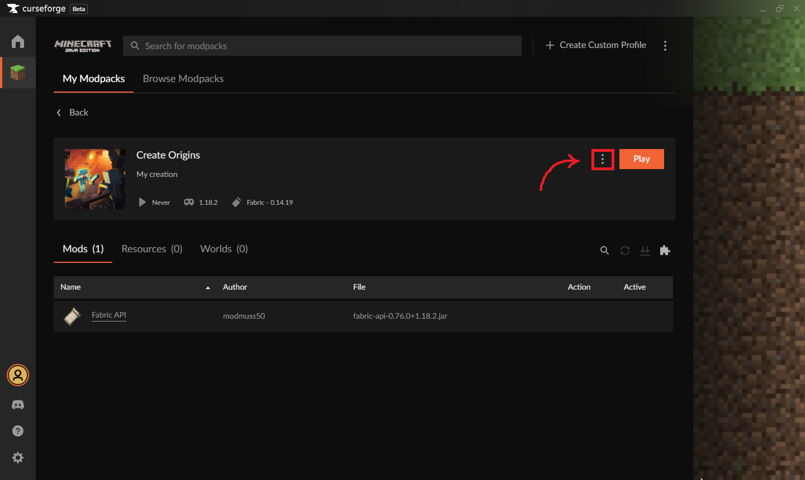
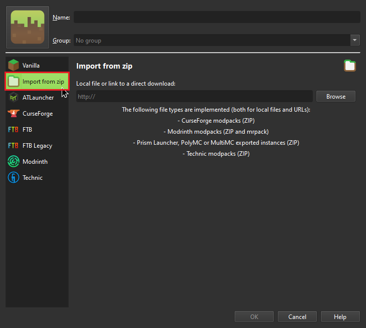

# CurseForge (Overwolf and Standalone)
## Installation(skip if you already have CF installed)
1. Go to [CurseForge Download Page](https://download.curseforge.com/) and download the desired installer(overwolf or standalone version whichever you prefer or whichever is available for your system)

2. Launch downloaded executable and proceed with the installation

3. When installation finishes, open your freshly installed Curforge client if not already

## Installing/Importing the modpack
Now, there's two ways to install the modpack, Manually create profile, or Import ready profile

For people new to modding scene, Importing a ready profile is heavily recommended, as you won't have to worry about messing something up, however it's up to you which path shall you choose, i will now walk you through the both methods of installation

### Import a ready profile
1. If not already download a Ready CF profile of the desired season from [Here](https://drive.google.com/drive/folders/10sB3H1lroabUVkUj3YR68M-hDPYpU48b?usp=sharing)

2. In CurseForge click on "Create Custom Profile" in the top-center

3. Then at the top of the newly formed window, click "import"

4 Navigate to the folder you've downloaded the profile into(usually it's ..\Downloads) and click on it

5 You're done, CurseForge will download all the mods and set up the environment for you, all you need now is to wait, and when it's done, you can hit "Play"

6 (Optional, Recommended) go to CurseForge's settings(the gear in the bottom-left)

7. (Optional, Recommended) Then under "Game Specific" section click on "Minecraft"

8. (Optional, Recommended) Scroll a little bit down and increase the "Allocated Memory" to at least 8192MB(8GB) for the best performance, however the more you allocate - the better, just make sure that you have enough RAM available on your PC

Just make sure you have enough Ram available on your system

### Manually create a profile
1. If not already, download raw modpack files from [Here](https://www.dropbox.com/sh/bysbawq6t98li80/AAALsWCoH41dsXaiBdDc2efRa?dl=0)

2. In CurseForge click on "Create Custom Profile"

3. Select parameters as shown on the Screenshot below and name the profile how you want, after all that, hit "Create" and wait while CurseForge prepares minecraft environment

4. Now, when the environment preparation is complete, click on three dots near "Play" button

5. Then hit "Open Folder"

6. Extract the files from downloaded zip into the newly opened window and replace files/merge folders if prompted

7. (Optional, Recommended) go to CurseForge's settings(the gear in the bottom-left)

8. (Optional, Recommended) Then under "Game Specific" section click on "Minecraft"

9. (Optional, Recommended) Scroll a little bit down and increase the "Allocated Memory" to at least 8192MB(8GB) for the best performance, however the more you allocate - the better, just make sure that you have enough RAM available on your PC

Just make sure you have enough Ram available on your system

Now you're good to go, hit "Play" and launch minecraft

# Prism Launcher
## Installation(skip if you already have Prism installed)
1. Navigate to [Prism Launcher download page](https://prismlauncher.org/download/) and download the installer for your system

2. Launch downloaded executable and proceed with the installation

3. When installation finishes, open your freshly installed Prism Launcher if not already

## Installing/Importing the modpack
For Prism Launcher there's three ways of installing the modpack, Manual, import CF profile, or download from Modrinth

### Import a ready profile
1. If not already download a Ready CF profile of the desired season from [Here](https://drive.google.com/drive/folders/10sB3H1lroabUVkUj3YR68M-hDPYpU48b?usp=sharing), or raw modpack files from [Here](https://www.dropbox.com/sh/bysbawq6t98li80/AAALsWCoH41dsXaiBdDc2efRa?dl=0)

2. In Prism click on "Add instance" in the top-left corner

3. Then at the side of the newly formed window click "import from zip"

4. Then click "Browse"

3. Navigate to the folder you've downloaded the profile into(usually it's ..\Downloads) and click on it, then click "Ok" at the bottom of the window

4. You're done, Prism will download all the mods and set up the environment for you, all you need now is to wait

5.(Optional, Recommended) go to Prism's settings(the "Settings" button in the toolbar)

6.(Optional, Recommended) Under "Java" section edit "Maximum memory allocation" value to be at least 8192MiB, Prism should tell you if that ammount is safe to be allocated with your system's available memory(RAM), if you see a red cross, reduce the maximum allocation until it's a yellow tilde(~) or a green checkmark

### Manually create a profile
1. If not already, download raw modpack files from [Here](https://www.dropbox.com/sh/bysbawq6t98li80/AAALsWCoH41dsXaiBdDc2efRa?dl=0)

2. In Prism click on "Add Instance"

3. Select parameters as shown on the screenshot below and name the profile how you want

4. After all that, hit "Ok" and wait while Prism prepares minecraft environment

3. Now, when the environment preparation is complete, click on the instance and then hit "Folder" in the side menu
4. In the opened explorer window navigate inside folder named "minecraft"

4. Extract the files from downloaded zip into the open folder and replace files/merge folders if necesarry

5.(Optional, Recommended) go to Prism's settings(the "Settings" button in the toolbar)

6.(Optional, Recommended) Under "Java" section edit "Maximum memory allocation" value to be at least 8192MiB, Prism should tell you if that ammount is safe to be allocated with your system's available memory(RAM), if you see a red cross, reduce the maximum allocation until it's a yellow tilde(~) or a green checkmark

Now you're good to go, hit "Launch" to play minecraft
  
### Download from Modrinth
The modpack is not yet uploaded, but guide will be updated as soon as it'll be up

# MultiMC
Instructions are the same as for Prism! not much differences, except MultiMC doesn't show if allocated RAM is safe or not, so be mindful!

# ATLauncher
Will be added soon!

# TLauncher
Will be added soon!
